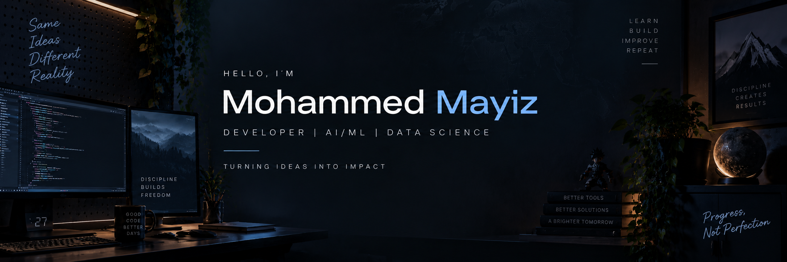

  

# Mohammed Mayiz

### Developer | AI/ML Enthusiast | Student

I enjoy building software, exploring AI and machine learning,
and turning ideas into practical applications.

## About Me

I'm Mohammed Mayiz, a student and developer interested in
building software, AI/ML solutions, and practical applications.
## Areas of Interest

- Web Development
- Data Science
- Machine Learning
- Artificial Intelligence
- Software Development
- Data Analytics
- 
- ## Featured Projects

### FixIt

A platform designed to streamline the process of reporting and managing maintenance issues.

**Focus:** Web Development, AI, Problem Solving

[View Repository](https://github.com/Mmyz03/fixitt)

### I-HEART

An AI-based health risk prediction project focused on diabetes and cardiovascular disease.

**Focus:** Machine Learning, Data Science, Artificial Intelligence

[View Repository](https://github.com/Mmyz03/I-HEART)

## Skills & Technologies

### Programming

  

### Web Development

  

### Data & AI

  

### Databases

  

### Tools & Platforms

  

## Connect With Me

  

